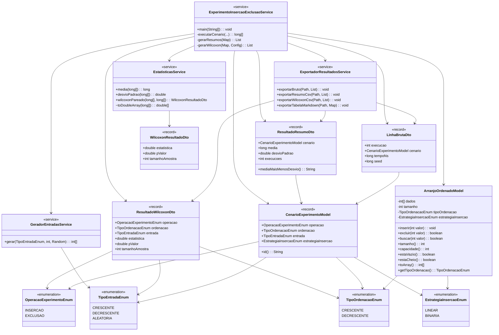

# ArranjoOrdenado - Experimento Cientifico

Projeto Java (Maven) para implementar e avaliar a estrutura de dados `ArranjoOrdenado` para inteiros, com suporte a ordenacao crescente e decrescente.

## Diagrama de Classes (UML)



## Como executar
### 1. Rodar testes unitarios
```bash
mvn clean test
```

### 2. Rodar experimento completo (oficial)
```bash
mvn exec:java
```

Parametros padrao do experimento:
- capacidade: `100000`
- execucoes por cenario: `100`
- comparacao linear x binaria: habilitada

### 3. Rodar experimento reduzido (validacao rapida)
```bash
mvn exec:java -Dexec.args="--capacidade=10000 --execucoes=10"
```

### 4. Desabilitar comparacao binaria (somente algoritmo linear)
```bash
mvn exec:java -Dexec.args="--sem-comparacao-binaria"
```

## Arquivos gerados em `resultados/`
- `tempos_brutos.csv`: tempos de cada execucao.
- `resumo.csv`: media e desvio padrao por cenario.
- `tabela_resultados.md`: tabela no formato `media +/- desvio`.
- `wilcoxon.csv`: estatistica e p-valor do teste de Wilcoxon.

## Tabela esperada (formato)
Exemplo de tabulacao:

| Insercao | Ordenacao crescente | Ordenacao decrescente |
|---|---|---|
| Insercao em maneira crescente | 10 +/- 0.3434 | 10 +/- 0.3434 |
| Insercao em maneira decrescente | 10 +/- 0.3434 | 10 +/- 0.3434 |
| Insercao em maneira aleatoria | 10 +/- 0.3434 | 10 +/- 0.3434 |
